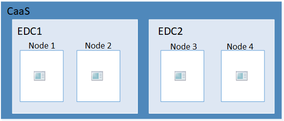
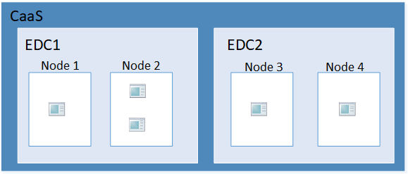
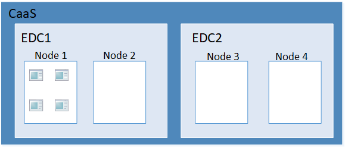
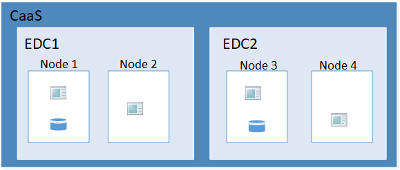
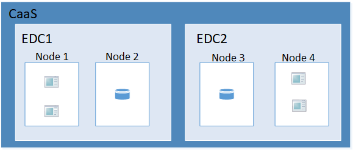

# Affinity Rules 

With Affinity Rules, you can control how and where your applications are run on the cluster. You can specify the nodes, datacenters, and how your applications are distributed among the nodes and datacenters. 

Each of the nodes and datacenters have topology keys (i.e. labels) to identify them. Each node has a topology key called `kubernetes.io/hostname`, which contains the node name. Each data center has a topology key called `failure-domain.ford.com/zone`. When referring to `hosts` and `zones`, we are referring to nodes and datacenters, respectively. 

## Required vs Preferred

There are two types of affinity (whether affinity or anti-affinity) rules you can choose: required and preferred. There are other sub-options, but as a whole: 

- Required: The rule MUST be met. If the rule is not met, the pod will not start and eventually kill itself. 
- Preferred: The rule will TRY to be met. If it is not met, then the pod will still be deployed, but not with the rule. 

## Example 1

In this example, we would specify `AntiAffinity` rules for our application for the host and the zone. This means Kubernetes will attempt to always put your application on different nodes and datacenters. 

Notice there are multiple application replicas in the same datacenter. This means the topology key for `zone` is a "preferred" rule. Kubernetes will attempt to put the replicas in a different `zone`, but when it cannot meet that rule, it will put replicas in the same node. 

## Example 2

This example is the same as the previous, but if the number of replicas exceed the number of nodes, you will need to use the `host` topology key in a "preferred" rule. Kubernetes attempts to put replicas on a different node, and when it no longer can, it begins putting replicas on the same node. 

**NOTE**: This is an unlikely scenario as there dozens of nodes on the cluster.

## Example 3

To provide an alternate example, this is when you provide a `podAffinity` rule as opposed to a `podAntiAffinity` rule on your application. Defining `podAffinity` rules for the `host` and the `zone` would tell Kubernetes to put all replicas in the same datacenter and on the same node.

Again, this is an unrealistic use case provided as an opposite example. 

## Example 4

This example is a replica of the first example. However, here we introduce a database as well. In this example, we define `podAffinity` rules for the database in our application's manifest. This means that Kubernetes will put the database on the same node as an application replicas. 

## Example 5

In contrast to the previous example, if we define `podAntiAffinity` rules on our database in the application manifest, Kubernetes will ensure our database sits on a different node than the application instances. Choosing between this use case and the previous may be a decision based on speed versus security. 