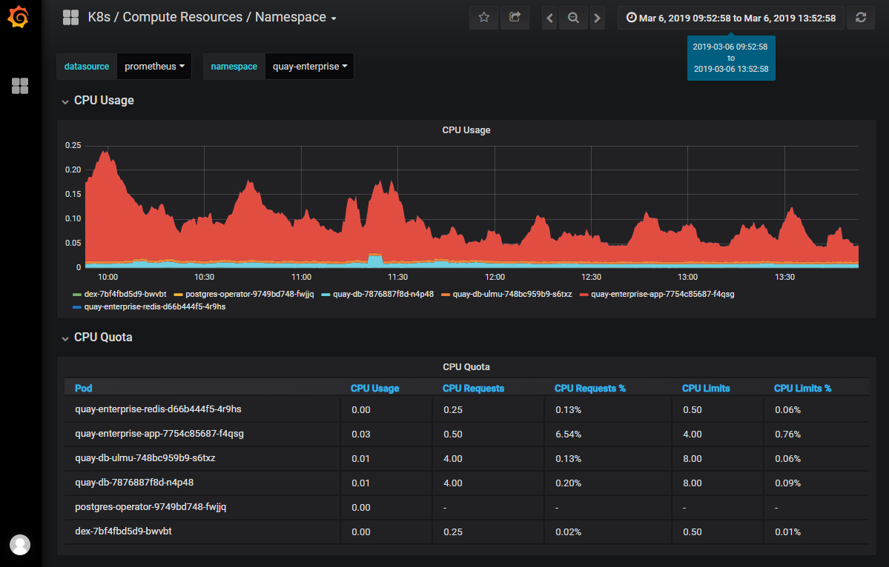

## Day 2 - Lesson 3

### Monitoring Apps

By now you have a basic understanding of how to:
- Build a container image for your app
- Push that image in Ford's image registy for future use
- Run that image on Ford's CaaS platform

This lesson will focus on more complicated use cases as well as additional topics that will keep your app running well after you've launched it (sometimes called 'Day 2 Operations'). For example, configuring a vanity URL and monitoring your app's performance.

### CaaS 

If your app is deployed on CaaS, you get basic monitoring of your app's resource utilization by default. The platform provides a real-time monitoring dashboard built using the Prometheus and Grafana tools without additional cost.

If you need more app performance monitoring capabilities than the basic monitoring provided by the platform, you can connect your app to Ford's Dynatrace instance for a cost. You can sign up on the [Dynatrace team website](https://it1.spt.ford.com/sites/L1POE/Public/SitePages/Dynatrace.aspx).



#### Exercise - Production Grafana

1. Bring up the CaaS monitoring dashboard in a web browser. Go to https://grafana-openshift-monitoring.app.caas.ford.com. You might want to bookmark this link for future use.
2. Click the drop-down menu in the upper left and select the `K8s / Computer Resources / Namespace`. This brings up a dashboard where you can filter by namespace.
3. Let's view the resource utilization of apps in the Quay namespace. Use the namespace dropdown to select `devenablement-dev`.
4. Here you can review the CPU and memory quota and utilzation of all pods associated with the Quay namespace. Use the tools in the upper right to adjust the timeframe.

#### Exercise - Localdev Grafana

1. Navigate to your localdev directory and bring up your VM. If you did not make the environment variables from Day 1 permanent, you will have to declare them again. 

```bash
$ export LOCAL_DEV_PROFILE='basic-cnx'
$ export ADDITIONAL_SYNCED_FOLDERS='/c/YOUR_PATH_TO_REPO/samples=>/home/vagrant/containers'
$ vagrant up
```

2. Navigate to https://api.oc.local:8443/console/ and look for your springboot-hello-world project. If you properly suspended your VM from Day 1, the project ought to still exist. If not, re-create the project using the steps below. 

```bash
# SSH into the VM
$ vagrant ssh

# Log into Openshift
[vagrant@m1 ~]$ oc login https://api.oc.local:8443
Username: admin
Password: sandbox
Login successful.

# Create the project
[vagrant@m1 ~]$ oc new-project springboot-hello-world

# Deploy your secret
[vagrant@m1 ~]$ oc create -f /home/vagrant/containers/springboot/manifest/pullsecret.yaml
secret/devenablement-workshop-pull-secret created

# Deploy your app
# Since we already pushed our image to Quay and edited our manifest in Day 1, we do not need to repeat those steps again
[vagrant@m1 ~]$ oc create -f /home/vagrant/containers/springboot/manifest/deployment.yaml
```

3. Bring up the localdev instance of Grafana in a web browser. Go to https://grafana-openshift-monitoring.app.oc.local/. 
    - Login using the localdev credentials: `admin` and `sandbox` as the username and password, respectively
4. View the different options available to admins. 
5. Click the drop-down menu in the upper left and select the `K8s / Computer Resources / Namespace`. This brings up a dashboard where you can filter by namespace.
6. Click the `namespace` dropdown and search for `springboot-hello-world` 
7. Review the CPU and memory quota and utilization for the projects running in your localdev instance of Openshift.

---

Continue to [Lesson 4.1](./lesson4.1.md)

Return to [Table of Contents](https://github.ford.com/DevEnablement/caas-workshop/tree/workshop-reformat#agenda)