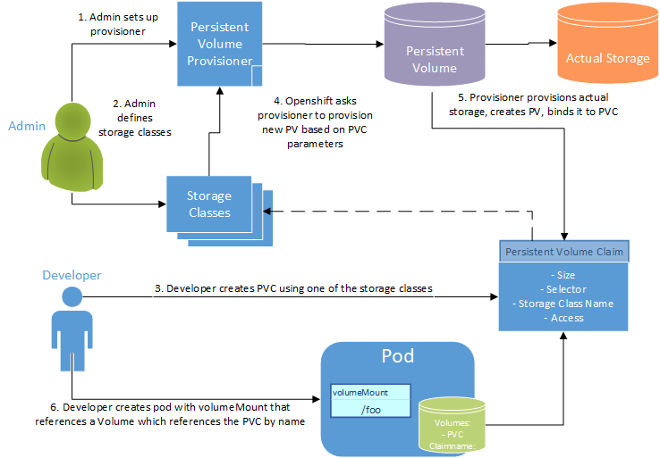

# Kubernetes Volumes

Since containers are not persistent, all their contents are cleared whenever the pod they are contained within is destroyed. The file system is completely fresh with each pod and file systems do not persist unless you define them through Persistent Volume Claims.

[Persistent Volume Claims](https://kubernetes.io/docs/concepts/storage/persistent-volumes/) represent a desire for some amount of storage with a certain performance, name, and access type. OpenShift has a provisioner that will look at a new Persistent Volume Claim and allocate a Persistent Volume that can satisfy the needs of the claim. In other words there is a big chunk of storage managed by OpenShift which will be divided up and provided to applications when they create a Persistent Volume Claim.

### Diagram

### Class Types

There are different classes of storage available in Ford's OpenShift. They might differ in quality-of-service levels, backup policies, or other arbitrary policies. In localdev, the available storage class is nfs. In production OpenShift, the classes are:

#### OpenShift 4.x
- px-repl2-block
- px-repl2-db-block
- px-repl2-file

> :exclamation: Block volumes CANNOT be attached to multiple container instances at the same time - file volumes CAN. Mounting and cross-mounting are only for file based storage plans - block storage plans cannot be concurrently mounted.

Below are further definitions for the storage classes.

| Name              | Type                                          | Purpose                                |
| ----------------- | --------------------------------------------- | -------------------------------------- |
| px-repl2-block    | Block Storage (High Available)                | Two storage copies across data centers |
| px-repl2-file     | File storage (shared- NFSV4)                  | Two storage copies across data centers |
| px-repl2-db-block | Block Storage (optimized for nosql databases) | Two storage copies across data centers |

### Access Types

- Single User (RWO - Read Write Once)
  - The volume can be mounted as read-write by a single node
- Shared Access (RWX - Read Write Many)
  - The volume can be mounted as read-write by many nodes
- Read Only (ROX - Read Only Many)
  - The volume can be mounted read-only by many nodes

### Connection Speed
All storage in CaaS is the equivalent of the Extreme storage class available in
the [Cloud Portal](https://www.cloudportal.ford.com/storage).
- Maximum SLO: 12,288 IOPS/TB
- Minimum SLA: 6,144 IOPS/TB
- Latency-sensitive applications
- 12 cents/GB per month

---

Please watch this short series of videos for further information

- [Intro to Persistent Volume Claims](https://www.youtube.com/watch?v=VB7vI9OT-WQ)
- [Understanding Persistent Volume and Persistent Volume Claim](https://www.youtube.com/watch?v=OulmwTYTauI&t=)
- [How Things Connect](https://www.youtube.com/watch?v=X6Vkz-ny574)

CaaS Engineering also has a [document](https://docs.caas.ford.com/docs/persistent-storage-using-portworx/) on Ford's PVC implementation.

---

Continue to [Stateful Sets](./15-statefulset.md)

Return to [Table of Contents](../README.md#agenda)
