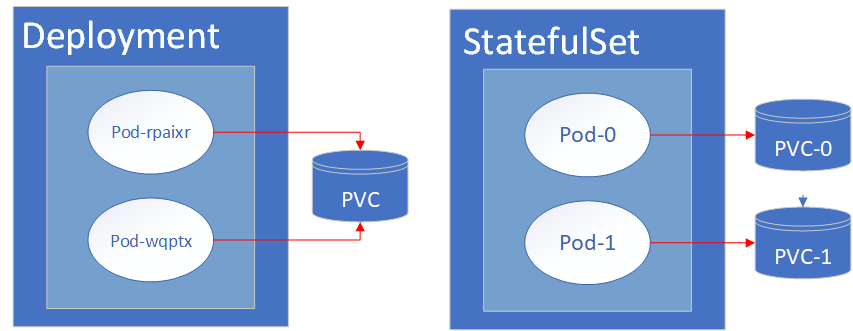

# Stateful Sets

Kubernetes provides two similar controller objects, Deployment and StatefulSet. Generally, stateless applications should use Deployment objects and stateful applications should use StatefulSet.

StatefulSets are useful when the desired number of pod replicas is roughly static and the pods need a sticky identity. Scaling horizontally with StatefulSets is not as elegant as with a Deployment, but can be done with more effort. If you find yourself scaling a StatefulSet up or down frequently, it may be a sign that a Deployment is a better fit for your use case.

## Storage Impacts

When volumes are mounted in pod replicas of a Deployment, each replica uses the same PersistentVolumeClaim and therefore the same Volume. For example, if pod A writes a file to a VolumeMount location such as `/mnt/vol1`, then pod B would also be able to access that file at `/mnt/vol1`.

In contrast to a Deployment, when volumes are mounted in pod replicas of a StatefulSet, each replica gets its own PersistentVolumeClaim and unique Volume. In this case, a file written to a VolumeMount location by pod A, would not be accessible by pod B. The system will also ensure that if a StatefulSet pod is restarted, it will get reconnected to the same Volume and all of the data will still be intact.

In fact, a PersistentVolumeClaim that is created by a volumeClaimTemplate of a StatefulSet, is really persistent. Even if the StatefulSet is deleted by `oc delete -f ./statefulset.yaml`, the PersistentVolumeClaim is not altered. The PVC can only be deleted explicitly with `oc delete pvc MY_PVC`. This will also delete the associated PersistentVolume and all data is deleted.

Stateful set pods also keep their same name although their IP addresses will change. This is useful for stateful technologies that write data to a specific location using a DNS name and expect that data to persist at that location.

### Routing Impacts

Stateful Sets are also useful when you need a client to be routed to the same pod for each call. Stateful technologies like Cassandra, MongoDB, and others require this functionality.

### Scaling Scenario

You can scale horizontally with StatefulSets, but note that if PVCs and PVs are created during a scale up event, those objects are persistent after scale down. They must be deleted manually if that is the desired behavior. Additionally, Kubernetes does not notify clients calling a StatefulSet that a scale event has occurred. For these reasons, scaling with a StatefulSet is not as straightforward as scaling with a Deployment fronted by a Load Balancer.

## Resources

- [Kubernetes Docs](https://kubernetes.io/docs/concepts/workloads/controllers/statefulset/)
- [Kubernetes Tutorial](https://kubernetes.io/docs/tutorials/stateful-application/basic-stateful-set/)

---

Continue to [Monitoring](./16-monitoring.md).

Return to [Table of Contents](../README.md#agenda)
