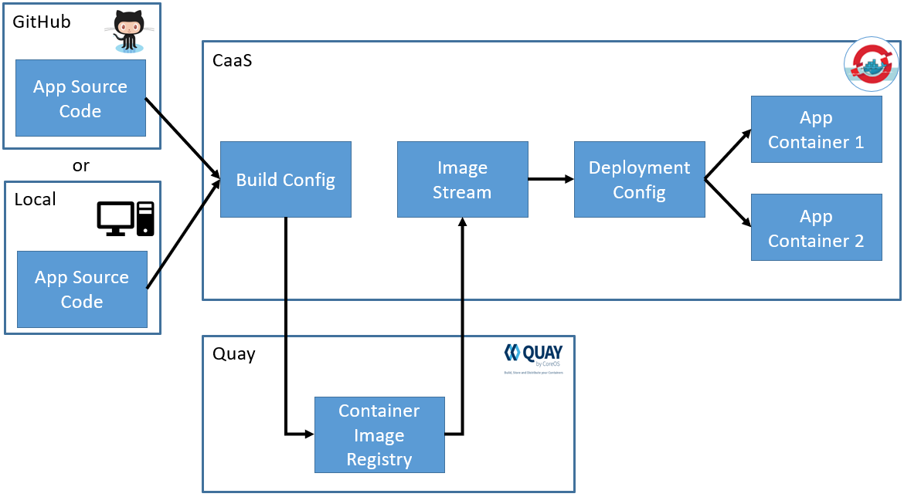

# End to End Example

<p align="center">
  
</p>

Now that we've introduced a number of concepts and objects, let's make a code change. After we make the code change, we will start our build and see that OpenShift handles everything afterwards automatically.

### Change Code

1. Let's revert our changes from earlier. Remove the `-v2` in `build-config-2.yaml` (line 11) so that our tag is back to just being our CDSID.

2. Change the value(s) of line 28, 29, 30 to whatever message you'd like in the quoted sections for the `SUMMARY`, `DESCRIPTION`, and `NAME` environment variables. **Do not** remove the `\` at the end of lines 28 and 29.

3. Apply the changes to your build config.

```bash
$ oc apply -f ./manifests/build-config-2.yaml
```

### Build New Image

4. Let's start a new build with our new code, which will result in a new container image stored in Quay

```bash
$ oc start-build app-build-<CDSID> --from-dir=./ --wait=true
Uploading directory "build\\libs" as binary input for the build ...
......
Uploading finished
build.build.openshift.io/app-build-<CDSID>-4 started
```

### Point Service to DeploymentConfig

5. In order for us to see the updated code at the URL we created, we need to change the `Service` to point to the `DeploymentConfig` rather than the `Deployment` we were using earlier.

   Open `./manifests/service.yaml` and append `-config` to line 11, so it reads:
   ```yaml
   app: <CDSID>-deployment-config
   ```

6. Apply the new `Service` configuration to the cluster.

```bash
$ oc apply -f ./manifests/service.yaml
```

### Watch Updates

7. Go to the [image streams](https://console-openshift-console.apps.pd01.edc.caas.ford.com/k8s/ns/devenablement-workshop-dev/imagestreams) section in OpenShift. It may take up to 15 minutes for the `ImageStream` to detect the updated image in Quay.

8. Once you see that your `ImageStream` has updated, go to the [deployments](https://console-openshift-console.apps.pd01.edc.caas.ford.com/k8s/ns/devenablement-workshop-dev/deploymentconfigs) section in OpenShift and select your `DeploymentConfig`. We can now watch the process of the `DeploymentConfig` doing the following steps:

- Bringing up a `ReplicationController` with your new application image in the background
- Ensuring your pods pass their probes
- Scale down and delete your old `ReplicationController`
- Make the  `ReplicationController` with the new application the actively running application

9. When these steps are made, your can go to your route (https://MY-CDSID.apps.pd01.edc.caas.ford.com) and see your new greeting.

---

Continue to [Continuous Integration](./19-contint.md).

Return to [Table of Contents](../README.md#agenda)
