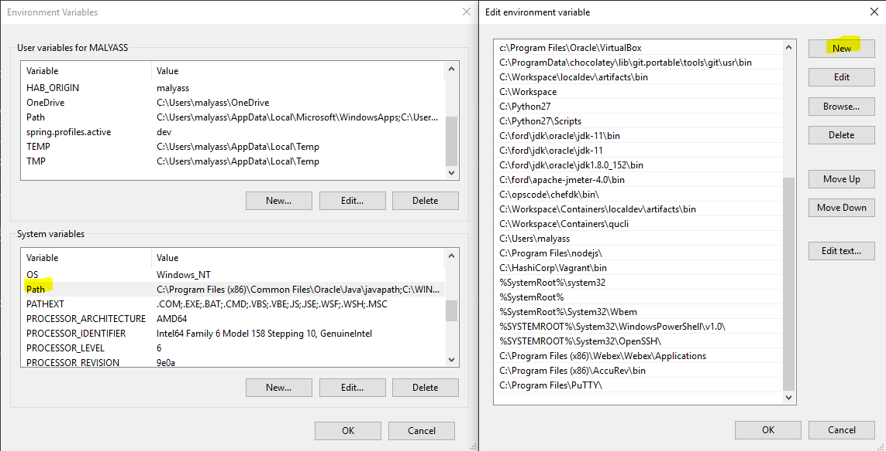

# Workstation Setup and Homework

Before attending the workshop, you must pre-install some software on your laptop or workstation. You will likely be on wireless during the workshop, and the initial installation and setup of these packages will take time if done over wireless. 

---

### Samples Repository

1. The CaaS team maintains a repository of sample apps that will run on CaaS. You will clone this repo locally, and then go through the process of building a container image with one of the sample apps.

2. Navigate to any workspace directory of your choosing. 

```bash
cd ~/workspace
```

3. Clone the samples repository. If you have the Github desktop application, you can use that to clone the repository. 

```bash
git clone git@github.ford.com:MALYASS/samples.git      # Using SSH
git clone https://github.ford.com/MALYASS/samples.git  # Using HTTPS
```

### OC CLI

To deploy objects into Openshift, you will need the `oc` CLI. 

1. Go to https://files.caas.ford.com:9443/oc-cli/latest/ and click on the proper download for your operating system. 
2. Extract the contents of the `.zip` to a permanent location (such as C:/Users/<YOUR_CDSID>)
3. Add the path to the `oc` binary to your system's path.
  - Windows



---

Additionally, you will get much more out of the class if you come in with a high-level understanding of Containers and Kubernetes. Please take 20 minutes to review these videos prior to class.

- [What is a Container?](https://www.youtube.com/watch?v=EnJ7qX9fkcU&t=969s) You only need to watch up to 12:30. The remainder of video is specific Docker which is not directly relevant to CaaS.
- [Kubernetes in 5 Minutes](https://www.youtube.com/watch?v=PH-2FfFD2PU)

---

Return to [Table of Contents](./README.md#agenda)
